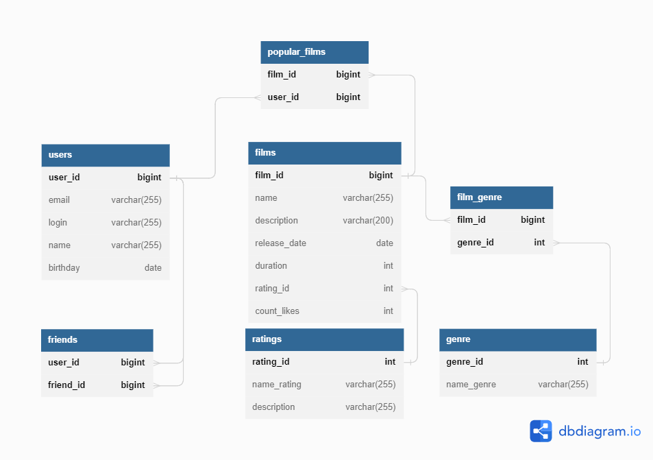

# java-filmorate
**Бэкенд для сервиса, который будет работать с фильмами и оценками пользователей, а также возвращать топ-5 фильмов, рекомендованных к просмотру.**
## Стек используемых технологий:
Java 11, REST-сервис с использованием Spring Boot, JDBC, Lombok, Maven, JUnit, H2.
## Краткое описание БД - из каких таблиц и представлений состоит.  
___
### Диаграмма БД.  
  

#### Таблицы:

1. **users** 

   id - целочисленный идентификатор **первичный ключ**;  
   email - электронная почта;
   login - логин пользователя;  
   name - имя пользователя (для отображения);  
   birthday - дата рождения.  

2. **films**   
   film_id - целочисленный идентификатор **первичный ключ**;  
   name - название;  
   description - описание;  
   releaseDate - дата релиза;  
   duration - продолжительность фильма;  
   id_rating - целочисленный идентификатор рейтинга;  
   count_likes - количество лайков.

3. **genre**    
   id_genre - целочисленный идентификатор **первичный ключ**;  
   name_genre - название жанра.  

4. **ratings**     
   id_rating - целочисленный идентификатор **первичный ключ**;  
   name_rating - значение;  
   description - описание.

6. **friends**   
   id_user - целочисленный идентификатор пользователя;  
   id_friend - целочисленный идентификатор пользователя.  
   _Первичный ключ комплексный (1 и 2 поля)_

7. **film_genre**  
   film_id - целочисленный идентификатор фильма;  
   id_genre - целочисленный идентификатор рейтинга.  
   _Первичный ключ комплексный (1 и 2 поля)_

8. **popular_films**  
    film_id - целочисленный идентификатор фильма;  
    id_user - целочисленный идентификатор пользователя.  
    _Первичный ключ комплексный (1 и 2 поля)_

### Пояснение к схеме - описание таблиц, логики, связей и задачи, которые можно решить, используя БД.  

#### Таблица users  

Таблица содержит список пользователей приложения.   
Каждый пользователь идентифицируется целочисленным идентификатором (id).  
Поля электронная почта (email), логин (login), дата рождения (birthday)- обязательно должны содержать данные.  
В поле дата рождения (birthday) входит только дата (тип данных date).  

#### Таблица films   

Таблица содержит список фильмов.   
Каждый фильм идентифицируется целочисленным идентификатором (film_id).  
Поля название (name), описание (description), продолжительность фильма (duration) и 
идентификатор рейтинга (id_rating) - обязательно должны содержать данные.  
Максимальная длина описания — 200 символов.  

#### Таблица genre

Таблица содержит список жанров фильма.
Каждый жанр идентифицируется целочисленным идентификатором (id_genre).  
Поле название жанра (name_genre) - обязательно для заполнения.  
Список возможных значений:
* Комедия.
* Драма.
* Мультфильм.
* Триллер.
* Документальный.
* Боевик.

#### Таблица ratings
Таблица содержит список рейтингов Ассоциации кинокомпаний.  
Каждый рейтинг идентифицируется целочисленным идентификатором (id_rating).    
Поле name_rating - обязательно для заполнения.  
Эта оценка определяет возрастное ограничение для фильма. Значения могут быть следующими:  
* G — у фильма нет возрастных ограничений,
* PG — детям рекомендуется смотреть фильм с родителями,
* PG-13 — детям до 13 лет просмотр не желателен,
* R — лицам до 17 лет просматривать фильм можно только в присутствии взрослого,
* NC-17 — лицам до 18 лет просмотр запрещён.

#### Таблица friends

Таблица содержит список друзей пользователя и статус подтверждения дружбы.  
Данная таблица связывает идентификаторы пользователей из таблицы **users**, которые подали заявку 
в друзья. Каждая пара id_user - id_friend является уникальной.
С помощью данной таблицы можно получить список общих друзей с другим пользователем.

#### Таблица film_genre

С помощью данной таблицы связывается идентификаторы таблиц films и genre.
Каждая пара в таблице должна быть уникальна.

#### Таблица popular_films

С помощью данной таблицы связывается идентификаторы таблиц films и users.
Каждая пара в таблице должна быть уникальна.

### Бизнес задачи, которые можно решить, используя БД

1. **Получение всех фильмов, пользователей**:
```
SELECT *
FROM films;

SELECT *
FROM users;
```
2. **Список общих друзей с другим пользователем**:
```
SELECT friend_id
FROM friends
WHERE user_id = 2
AND friend_id in (SELECT friend_id
                  FROM friends
                  WHERE user_id = 1);
```
3. **Вывод 10 наиболее популярных фильмов**:
```
SELECT pf.film_id, f.name, COUNT(pf.id_user) AS count
FROM popular_films AS pf
INNER JOIN films AS f ON pf pf.film_id = f.film_id
GROUP BY pf.film_id, f.name
ORDER BY count DESC
LIMIT 10;
```
